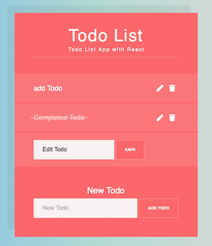

# Todo List with React

## Project Overview

Created a Todo App that allows users to view, add, edit, and remove todos. Each Todo component displays a button with an icon to "edit" it when clicked, it displays a form with the task of the todo as an input and a save icon to submit the form. When the form is submitted, the task of the text is updated and the form is hidden.

Alongside each Todo, the application is designed so that the todo itself can be clicked to mark it as completed. A strikethrough style to the Todo if it is completed. A user can toggle it on and off by clicking on the text of the todo.

  <b>Preview the Todo App:</b> 
  <a href="https://elated-northcutt-6fe96d.netlify.app/">Click Here</a> 
    
  

